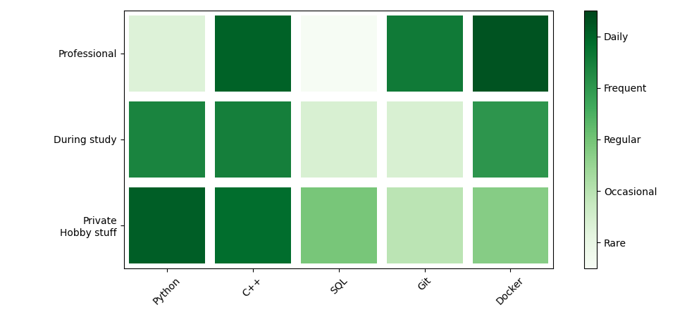
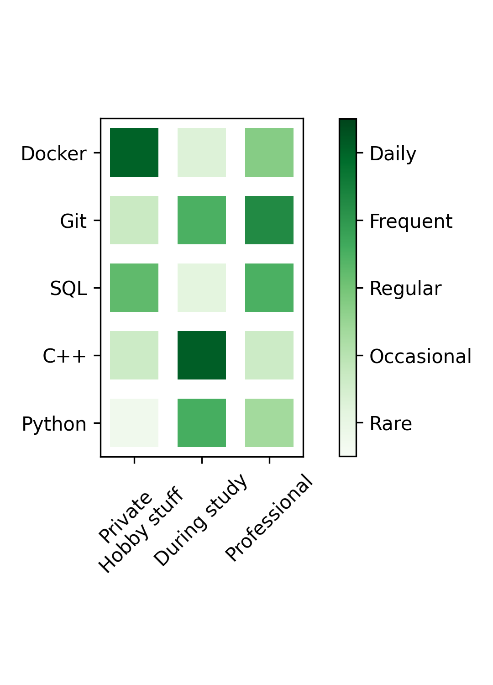

> **_NOTE:_**  In progress. Only experimental. Not ready for easy use yet.

# SkillPlot
A simple python package/script to create grid map based skill plots inspired by Githubs activity map. It is based on [matplotlib](https://matplotlib.org/) pcolormesh plotting.

Intention is to create a simple tool to create skill plots for CVs or similar.

### Horizontal
<p align="center">
  
</p>

### Vertical
<p align="center">
  
</p>

# Install from source
Until the package is on PyPI, you can install it from source with
```bash
git clone
cd skillplot
pip install -e .
```

# How to use
## 1. Create a configuration file
Create an example configuration file with
```bash
skillplot new
```
There are also option to create a configuration file with a specific size.
```bash
skillplot new --help # for more
```
## 2. Edit the configuration file
The configuration file is a simple YAML file. It has the following structure:
```yaml
cols: [Python, C++, SQL, Git, Docker]
level_names: [Rare, Occasional, Regular, Frequent, Daily]
levels:
# The "levels" field is a list of lists representing the levels, where each list represents a row in the plot.
# Python, C++, SQL, Git, Docker
- [92, 87, 49, 29, 45]  # Private Hobby stuff
- [78, 80, 18, 18, 71] # During study
- [16, 91, 1, 82, 95] # Professional
rows: ["Private\nHobby stuff", During study, Professional]
```
#### `cols`:
The labels for the columns. The first label is the leftmost column, the second label the second column and so on.
#### `rows`:
The labels for the rows. The first label is the topmost row, the second label the second row and so on.
#### `level_names`:
The labels for the levels. The first label is the lowest level, the second label the second lowest level and so on.
#### `levels`:
The actual data, describing the skill level for each tile. The first list in the list of lists represents the first row, the second list the second row and so on.
 
## 3. Plot the skill plot
```bash
skillplot plot <path/to/config.yaml>
```
